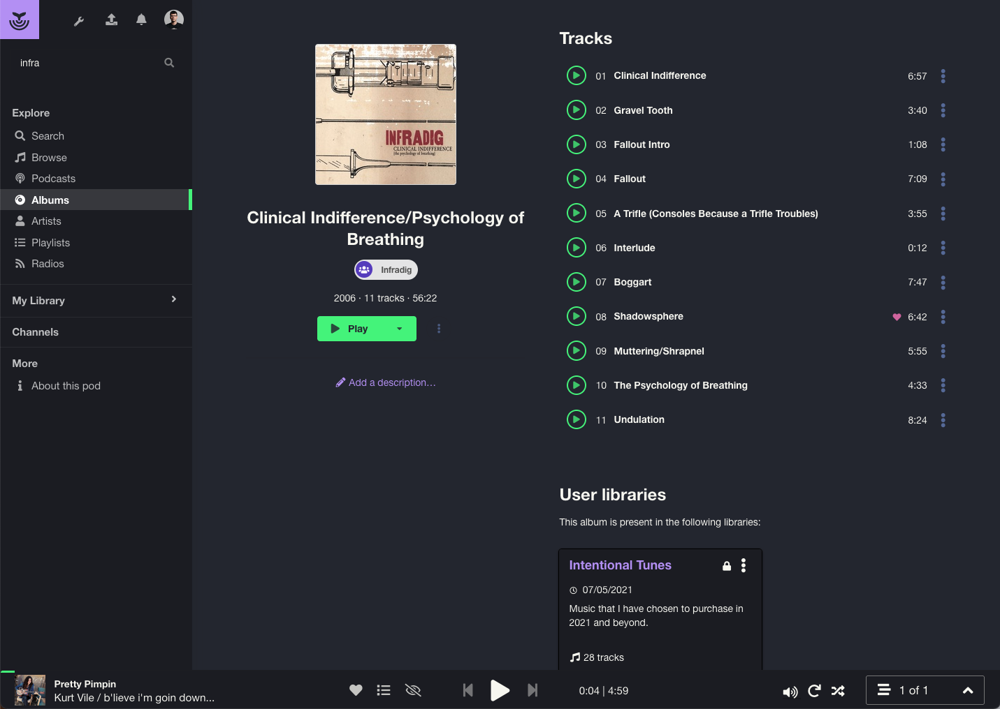

# Dracula for [Funkwhale](https://funkwhale.audio)

> A dark theme for [Funkwhale](https://funkwhale.audio).

## Install

All instructions can be found at [draculatheme.com/funkwhale](https://draculatheme.com/funkwhale).

## Team

This theme is maintained by the following person(s) and a bunch of [awesome contributors](https://github.com/dracula/funkwhale/graphs/contributors).

|  |
| ----------------------------------------------------------------------------------- |
| [Zack Stickles](https://github.com/zstix)                                           |

## Community

- [Twitter](https://twitter.com/draculatheme) - Best for getting updates about themes and new stuff.
- [GitHub](https://github.com/dracula/dracula-theme/discussions) - Best for asking questions and discussing issues.
- [Discord](https://draculatheme.com/discord-invite) - Best for hanging out with the community.

## License

[MIT License](./LICENSE)
